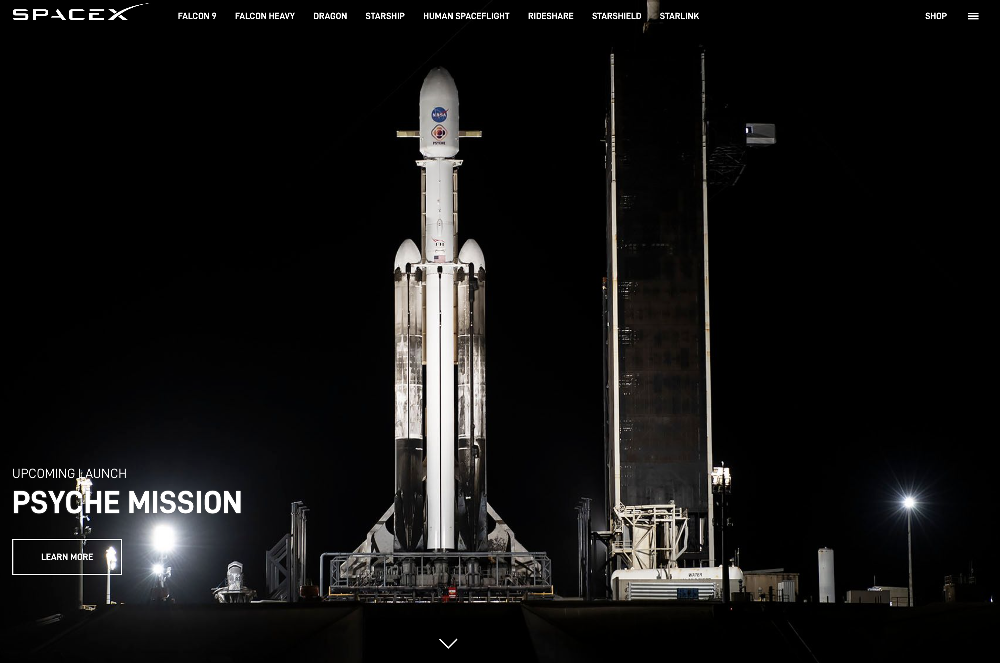
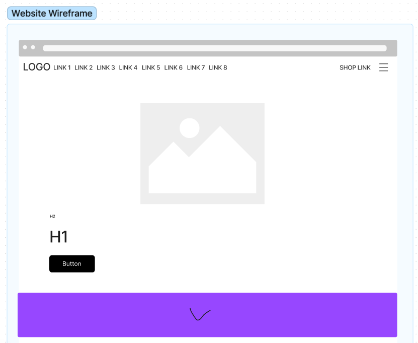

# spacex-wireframe

In this task we were asked to re-create this webpage:

I started off by making a wireframe using Figma:

(Hamburger Menu icon by Radek Fisera on Shutterstock)

Arrow symbol: https://www.svgrepo.com/svg/6500/down-arrow
